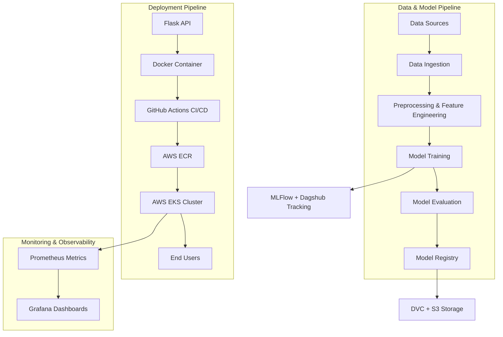

# 🚀 Capstone Project: End-to-End ML Deployment with MLOps



---

## 📑 Index

1. [Project Overview](#project-overview)  
2. [Technologies & Tools Used](#technologies--tools-used)  
3. [Project Workflow](#project-workflow)  
   - [1. Setting Up Project Structure](#1-setting-up-project-structure)  
   - [2. MLFlow Setup on Dagshub](#2-mlflow-setup-on-dagshub)  
   - [3. DVC Pipeline Setup](#3-dvc-pipeline-setup)  
   - [4. Flask App Integration](#4-flask-app-integration)  
   - [5. Dockerization](#5-dockerization)  
   - [6. AWS ECR & CI/CD](#6-aws-ecr--cicd)  
   - [7. EKS Deployment](#7-eks-deployment)  
   - [8. Monitoring with Prometheus & Grafana](#8-monitoring-with-prometheus--grafana)  
4. [How to Run Locally](#how-to-run-locally)  
5. [Future Improvements](#future-improvements)  
6. [Contributors](#contributors)

---

## 📌 Project Overview

This project demonstrates a **complete MLOps pipeline** – from data ingestion to deployment and monitoring of a machine learning model.  
It integrates **MLFlow, DVC, Docker, AWS (ECR & EKS), and monitoring tools (Prometheus & Grafana)** into a single workflow.

The deployed model is served using a **Flask API** running on **AWS EKS** with automated CI/CD pipelines.

---

## 🛠️ Technologies & Tools Used

| Category             | Tools / Technologies |
|----------------------|----------------------|
| Version Control      | Git, GitHub          |
| Environment          | Conda, Python 3.10   |
| Template             | Cookiecutter Data Science |
| Experiment Tracking  | MLFlow, Dagshub       |
| Data Versioning      | DVC + AWS S3          |
| Model Serving        | Flask                 |
| Containerization     | Docker, DockerHub     |
| CI/CD                | GitHub Actions        |
| Cloud Infrastructure | AWS (ECR, EKS, IAM, S3) |
| Monitoring           | Prometheus, Grafana   |
| Orchestration        | eksctl, kubectl       |

---

## 🔄 Project Workflow

### 1. Setting Up Project Structure
- Initialized repo with **cookiecutter-data-science**.
- Setup Conda virtual environment `atlas`.
- Configured project modules: `data_ingestion`, `data_preprocessing`, `feature_engineering`, `model_building`, `model_evaluation`, `register_model`.

---

### 2. MLFlow Setup on Dagshub
- Created a Dagshub repo and connected with GitHub.
- Integrated **MLFlow** for experiment tracking.
- Saved tracking URL and tokens as **GitHub secrets**.

---

### 3. DVC Pipeline Setup
- Initialized DVC (`dvc init`).
- Configured local & S3 remote storage.
- Defined pipeline stages in **dvc.yaml** (`data_ingestion → preprocessing → feature_engineering → model → evaluation`).
- Used `params.yaml` for hyperparameters.

---

### 4. Flask App Integration
- Created `flask_app/` directory for API.
- Exposed ML model inference endpoint via Flask.
- Verified locally before containerization.

---

### 5. Dockerization
- Created **Dockerfile** for Flask app.
- Built and ran image locally:
  ```bash
  docker build -t capstone-app:latest .
  docker run -p 8888:5000 -e CAPSTONE_TEST=<your_token> capstone-app:latest

* Pushed image to DockerHub.

---

### 6. AWS ECR & CI/CD

* Configured **IAM user + permissions**.
* Pushed Docker image to **AWS ECR**.
* Setup **GitHub Actions workflow (ci.yaml)** for:

  * Linting & testing
  * Building & pushing Docker images
  * Triggering deployment to EKS

---

### 7. EKS Deployment

* Created **EKS cluster** with `eksctl`.
* Applied `deployment.yaml` and `service.yaml` to expose app.
* Verified deployment with:

  ```bash
  kubectl get pods
  kubectl get svc
  ```
* Accessed API using LoadBalancer External IP.

---

### 8. Monitoring with Prometheus & Grafana

* Deployed **Prometheus** on EC2 (port 9090) to scrape app metrics.
* Installed **Grafana** on EC2 (port 3000).
* Added Prometheus as data source in Grafana.
* Built dashboards to monitor:

  * API Latency
  * Request count
  * Error rates
  * Model performance

---

## ▶️ How to Run Locally

1. Clone the repo:

   ```bash
   git clone https://github.com/your-username/capstone-project.git
   cd capstone-project
   ```

2. Create and activate environment:

   ```bash
   conda create -n atlas python=3.10
   conda activate atlas
   ```

3. Install requirements:

   ```bash
   pip install -r requirements.txt
   ```

4. Run Flask app:

   ```bash
   cd flask_app
   python app.py
   ```

5. Open in browser: `http://127.0.0.1:5000`

---

## 🔮 Future Improvements

* Automate data ingestion from real-time sources.
* Enable **model retraining & auto-deployment**.
* Integrate advanced monitoring with **alerting (Grafana Alerts, Slack, Email)**.
* Deploy on **multi-cloud environments**.

---

## 👨‍💻 Contributors

* **Utkarsh Sinha** – AI Engineer & Developer

---